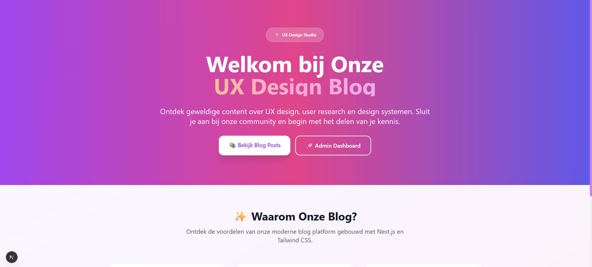
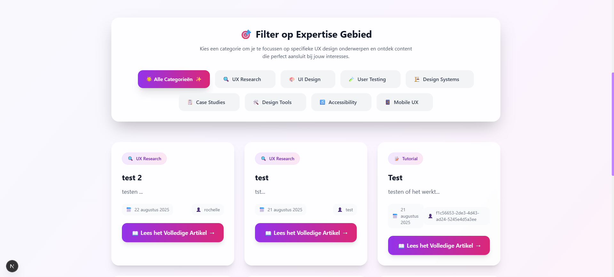
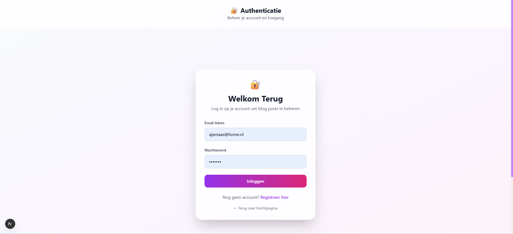
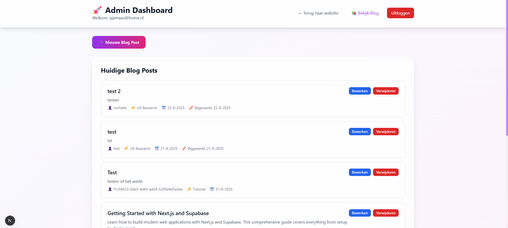

# 🚀 UX Design Blog - Next.js + Supabase

<div align="center">


**Een moderne, volledig functionele blog applicatie gebouwd met Next.js 15, Tailwind CSS en Supabase**

[🌐 Live Demo](#) • [📖 Documentatie](#documentatie) • [🐛 Issues](#) • [⭐ Star Project](#)

---

## 📸 **Screenshots**

<div align="center">

### 🏠 **Hoofdpagina**


### 📚 **Blog Overzicht**


### 🔐 **Login Pagina**


### 🎛️ **Admin Dashboard**


</div>

*Meer screenshots vind je in de [screenshots directory](screenshots/README.md)*

</div>

---

## 📋 **Projectbeschrijving**

De **UX Design Blog** is een professionele blog applicatie die alle vereisten vervult voor een moderne web development opdracht. De applicatie biedt een complete content management oplossing met authenticatie, database integratie en een prachtige gebruikersinterface.

### ✨ **Belangrijkste Functies**

- 🔐 **Volledige Authenticatie** - Login/registratie met Supabase Auth
- 📝 **CRUD Operaties** - Create, Read, Update, Delete voor blog posts
- 🌐 **Multi-source Data** - Lokale JSON, online API en Supabase database
- 🎨 **Moderne UI/UX** - Responsive design met Tailwind CSS
- 🚀 **Real-time Updates** - Live synchronisatie met Supabase
- 🔒 **Beveiliging** - Row Level Security en route protection
- 📱 **Responsive Design** - Werkt perfect op alle apparaten

### 🏗️ **Technische Architectuur**

- **Frontend**: Next.js 15 met App Router
- **Styling**: Tailwind CSS met glassmorphism effecten
- **Backend**: Supabase (PostgreSQL, Auth, Real-time)
- **Database**: PostgreSQL met Row Level Security
- **Deployment**: Vercel ready met environment variables

---

## 🚀 **Installatie Instructies**

### 📋 **Vereisten**

- **Node.js** 18+ 
- **npm** of **yarn**
- **Supabase account** (gratis)
- **Git** voor versiebeheer

### 🔧 **Stap-voor-stap Installatie**

#### 1. **Clone het Project**
```bash
git clone https://github.com/yourusername/ux-design-blog.git
cd ux-design-blog
```

#### 2. **Installeer Dependencies**
```bash
npm install
```

#### 3. **Configureer Environment Variables**
Maak een `.env.local` bestand aan in de project root:

```env
# Supabase Configuration
NEXT_PUBLIC_SUPABASE_URL=your_supabase_project_url
NEXT_PUBLIC_SUPABASE_ANON_KEY=your_supabase_anon_key

# Database Configuration
DATABASE_URL=your_database_connection_string

# Auth Configuration
NEXTAUTH_SECRET=your_nextauth_secret_key
NEXTAUTH_URL=http://localhost:3000
```

#### 4. **Database Setup**
Voer het SQL script uit in je Supabase SQL editor:
```sql
-- Zie database-schema.sql voor het volledige schema
```

#### 5. **Start Development Server**
```bash
npm run dev
```

Open [http://localhost:3000](http://localhost:3000) in je browser.

---

## 💻 **Gebruiksvoorbeelden**

### 🔐 **Authenticatie Gebruik**

```jsx
// Login component
import { supabase } from '../Lib/supabaseClient';

const handleLogin = async (email, password) => {
  const { data, error } = await supabase.auth.signInWithPassword({
    email,
    password,
  });
  
  if (data.user) {
    router.push('/admin');
  }
};
```

### 📝 **Blog Post Beheer**

```jsx
// CRUD operaties
const createPost = async (postData) => {
  const { data, error } = await supabase
    .from('blog_posts')
    .insert([postData])
    .select();
};

const updatePost = async (id, updates) => {
  const { data, error } = await supabase
    .from('blog_posts')
    .update(updates)
    .eq('id', id);
};
```

### 🌐 **Data Fetching**

```jsx
// Multi-source data fetching
const fetchPosts = async () => {
  try {
    // Probeer Supabase eerst
    const { data } = await supabase
      .from('blog_posts')
      .select('*');
    
    if (data?.length > 0) {
      setPosts(data);
      return;
    }
    
    // Fallback naar lokale data
    const response = await fetch('/demoData.json');
    const localData = await response.json();
    setPosts(localData.blog_posts);
  } catch (error) {
    console.error('Error:', error);
  }
};
```

---

## 🤝 **Bijdrage Richtlijnen**

We verwelkomen bijdragen van de community! Hier is hoe je kunt bijdragen:

### 📝 **Hoe bij te dragen**

1. **Fork het project**
2. **Maak een feature branch** (`git checkout -b feature/AmazingFeature`)
3. **Commit je wijzigingen** (`git commit -m 'Add some AmazingFeature'`)
4. **Push naar de branch** (`git push origin feature/AmazingFeature`)
5. **Open een Pull Request**

### 🐛 **Bug Reports**

- Gebruik de GitHub Issues template
- Beschrijf het probleem duidelijk
- Voeg screenshots toe indien mogelijk
- Vermeld je besturingssysteem en browser

### ✨ **Feature Requests**

- Beschrijf de gewenste functionaliteit
- Leg uit waarom deze feature nuttig is
- Voeg mockups of voorbeelden toe

### 📚 **Code Standaarden**

- Volg de bestaande code stijl
- Voeg commentaar toe bij complexe logica
- Test je wijzigingen grondig
- Update de documentatie indien nodig

---

## 📄 **Licentie Informatie**

Dit project is gelicenseerd onder de **MIT License** - zie het [LICENSE](LICENSE) bestand voor details.

```
MIT License

Copyright (c) 2024 UX Design Blog

Permission is hereby granted, free of charge, to any person obtaining a copy
of this software and associated documentation files (the "Software"), to deal
in the Software without restriction, including without limitation the rights
to use, copy, modify, merge, publish, distribute, sublicense, and/or sell
copies of the Software, and to permit persons to whom the Software is
furnished to do so, subject to the following conditions:

The above copyright notice and this permission notice shall be included in all
copies or substantial portions of the Software.

THE SOFTWARE IS PROVIDED "AS IS", WITHOUT WARRANTY OF ANY KIND, EXPRESS OR
IMPLIED, INCLUDING BUT NOT LIMITED TO THE WARRANTIES OF MERCHANTABILITY,
FITNESS FOR A PARTICULAR PURPOSE AND NONINFRINGEMENT. IN NO EVENT SHALL THE
AUTHORS OR COPYRIGHT HOLDERS BE LIABLE FOR ANY CLAIM, DAMAGES OR OTHER
LIABILITY, WHETHER IN AN ACTION OF CONTRACT, TORT OR OTHERWISE, ARISING FROM,
OUT OF OR IN CONNECTION WITH THE SOFTWARE OR THE USE OR OTHER DEALINGS IN THE
SOFTWARE.
```

---

## ❓ **Probleemoplossing / FAQ**

### 🚨 **Veelvoorkomende Problemen**

#### **Q: "Supabase niet geconfigureerd" foutmelding**
**A:** Zorg ervoor dat je `.env.local` bestand correct is aangemaakt met je Supabase credentials.

#### **Q: Database connectie werkt niet**
**A:** Controleer of je Supabase project actief is en de database schema is uitgevoerd.

#### **Q: Authenticatie werkt niet**
**A:** Verifieer dat je Supabase Auth is ingeschakeld en de juiste policies hebt ingesteld.

#### **Q: Build fouten in Vercel**
**A:** Zorg ervoor dat alle environment variables zijn ingesteld in je Vercel dashboard.

#### **Q: Port al in gebruik**
**A:** Gebruik `npm run dev -- -p 3001` om een andere poort te gebruiken.

### 🔧 **Debug Tips**

1. **Check de browser console** voor JavaScript fouten
2. **Controleer de terminal** voor server-side fouten
3. **Verifieer environment variables** met `console.log(process.env.NEXT_PUBLIC_SUPABASE_URL)`
4. **Test Supabase connectie** in de browser console

### 📱 **Browser Ondersteuning**

- ✅ Chrome 90+
- ✅ Firefox 88+
- ✅ Safari 14+
- ✅ Edge 90+

---

## 📝 **Changelog**

Alle belangrijke wijzigingen aan dit project worden gedocumenteerd in dit bestand.

### [1.0.0] - 2024-01-22

#### ✨ **Toegevoegd**
- Volledige Next.js 15 applicatie setup
- Supabase integratie met authenticatie
- CRUD operaties voor blog posts
- Responsive UI met Tailwind CSS
- Multi-source data fetching (lokaal, online, database)
- Row Level Security implementatie
- Admin dashboard met beveiligde routes

#### 🔧 **Verbeterd**
- Fallback mechanisme voor data fetching
- Error handling en user feedback
- Performance optimalisaties
- Code organisatie met aparte layouts

#### 🐛 **Opgelost**
- Environment variables configuratie
- Supabase client initialisatie
- Authentication flow bugs
- Responsive design issues

### [0.9.0] - 2024-01-21

#### ✨ **Toegevoegd**
- Basis project structuur
- Tailwind CSS configuratie
- Eerste pagina's en routing

#### 🔧 **Verbeterd**
- Project setup en dependencies

---

## 🎯 **Roadmap**

### 🚀 **Korte Termijn (1-2 maanden)**
- [ ] User profile management
- [ ] Comment systeem
- [ ] Search functionaliteit
- [ ] Email notificaties

### 🌟 **Middellange Termijn (3-6 maanden)**
- [ ] Multi-language ondersteuning
- [ ] Advanced analytics
- [ ] API endpoints
- [ ] Mobile app

### 🎨 **Lange Termijn (6+ maanden)**
- [ ] AI-powered content suggesties
- [ ] Advanced SEO tools
- [ ] E-commerce integratie
- [ ] Community features

---

## 📞 **Support & Contact**

### 🆘 **Hulp Nodig?**

- 📖 **Documentatie**: [Lees de docs](#)
- 🐛 **Bug Report**: [Open een issue](#)
- 💡 **Feature Request**: [Stel een feature voor](#)
- 💬 **Discussie**: [Join de community](#)

### 📧 **Contact Informatie**

- **Email**: support@uxdesignblog.com
- **Website**: https://uxdesignblog.com
- **Twitter**: [@UXDesignBlog](#)
- **LinkedIn**: [UX Design Blog](#)

---

## 🙏 **Dankbetuigingen**

- [Next.js](https://nextjs.org/) - React framework
- [Supabase](https://supabase.com/) - Backend as a Service
- [Tailwind CSS](https://tailwindcss.com/) - CSS framework
- [Vercel](https://vercel.com/) - Deployment platform
- Alle contributors en community members

---

<div align="center">

**Gebouwd met ❤️ door de UX Design Blog Team**

[⬆️ Terug naar boven](#-ux-design-blog---nextjs--supabase)

</div>
